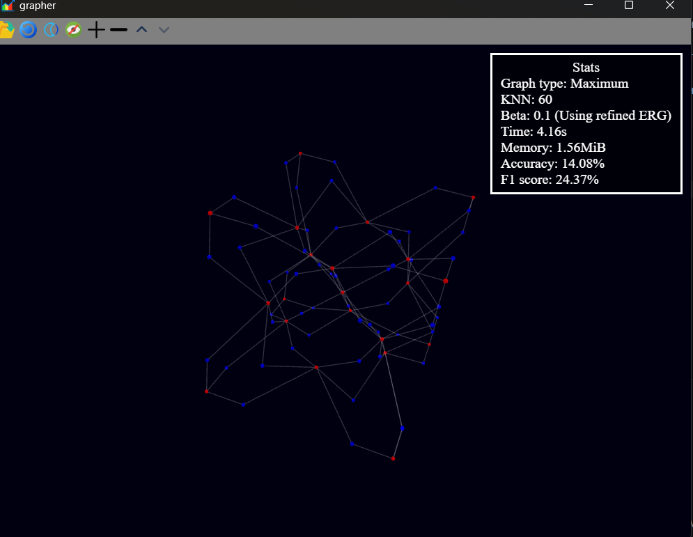
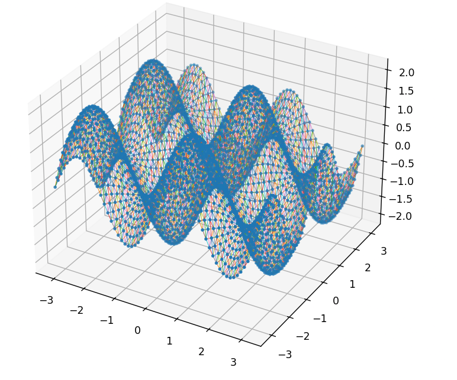
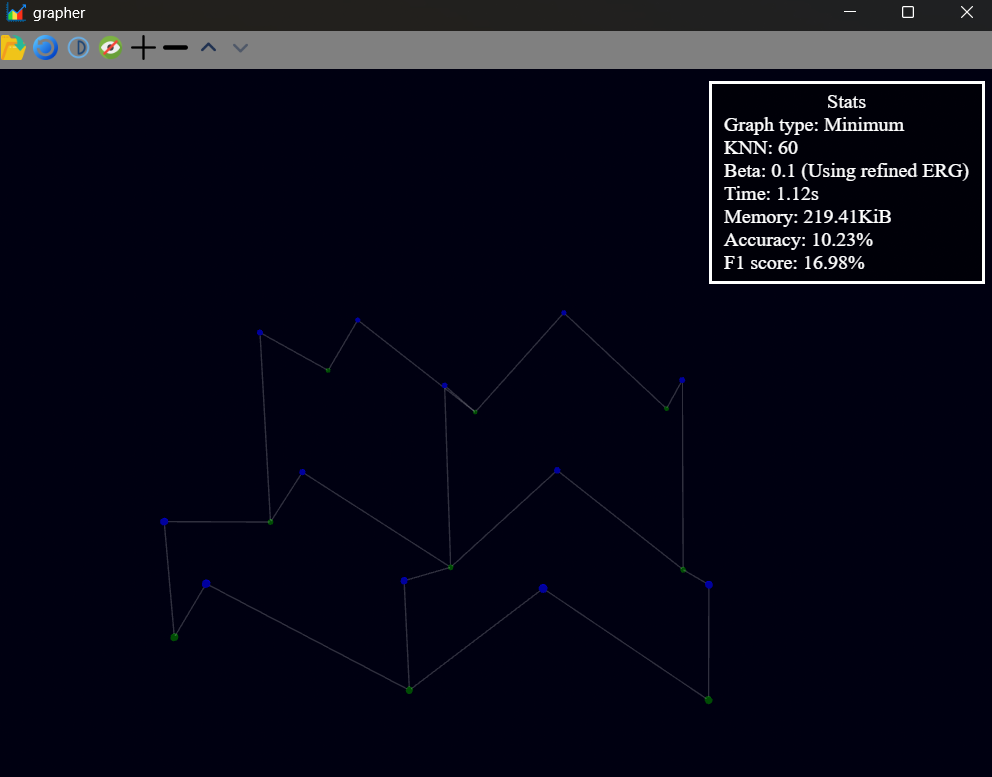

# Grapher
A simple UI tool to extract data from scalar fields and display the corresponding extremum graph. The goal is not just to build it, but 
to use a <b>streaming algorithm</b> as described in this paper [Scalable topological data analysis](https://arxiv.org/abs/1907.08325). 
The algorithm is based on techniques described in paper [Efficient computation of extremum graphs](https://arxiv.org/abs/2303.02724). 
The streaming algorithm focuses on reducing the large memory footprint often associated with computation of extremum graph for very high dimensional manifolds.

# Examples
 <br>
<center>A maximum extremum graph generated from a 3-manifold. The red nodes indicate maxima and blue indicate the 2-saddles.</center>

| 2-Manifold | Minimum extremum graph |
|--------|--------|
|  |  |

<center>Mininum extremum graph (right) that is generated for the 2-manifold on the left. The green nodes indicate the minima and blue indicate the 1-saddles</center> 

# Pipeline
The tool builds a reference extremum graph (from the given 1-skeleton of the manifold) and then builds another extremum graph
by estimating the neighborhood information using knn and beta pruning test. The 2 graphs are then compared via jaccard similarity and the score is output as accuracy. F1 score is also displayed for completeness.<br>
The user has option to toggle between different values of <b>K</b> and <b>beta</b> to test how the approximate graph changes. The app currently reads both VTK files and a custom file format known as manifold (.man) files. These manifold files are generated using a custom python script in <a href="scripts/manifold.py">manifold.py</a>. <br>
The <b>memory</b> stat describes how much memory is saved by not keeping the entire neighborhood information (graph) of the manifold. This generally tends to grow higher as the dimension of the manifold climbs higher.

# Build
To do development/debug build
```
npm run tauri dev
```

To do release build 
```
npm run tauri build
```

## Dependencies
* node
* npm